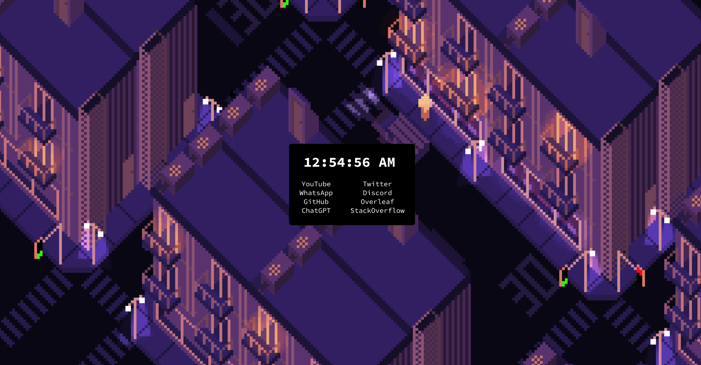

# Incrediblah

A hyper-customizable Angular-based start page for your browser!


## Screenshots




## Demo

A demo of the absolute default configuration can be found here: https://incrediblah.netlify.app/. Keep in mind that the colors, the fonts, the positioning, box style and background can be easily modified within the `config.json` file within `/src` after cloning.  
## Run Locally

1. Clone the project

```bash
  git clone https://github.com/SortyFix/incrediblah.git
```

2. Go to the project directory

```bash
  cd incrediblah
```

3. Run bash install script

```bash
  bash install.bash
```

4. Set your browser's start page to the port that has been defined in the `install.bash` script.  
*(default: `localhost:2118`)*. 

## Modify Incrediblah

1. Edit /src/config.json to modify your setup directly
2. After modification, run  
```
bash ~/incrediblah/update.bash
```
3. Reload the start page in case you have it open
## License

[GNU GPLv3](https://choosealicense.com/licenses/gpl-3.0/)

